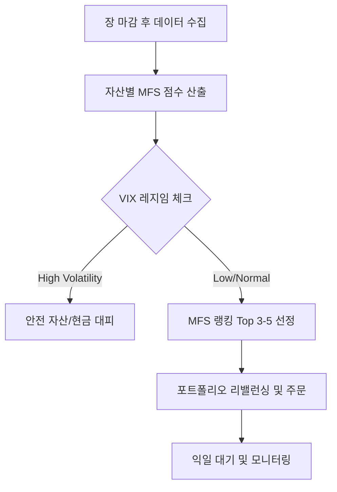

# MFS(Multi-Factor Score) 전략 운용 가이드 🧭

MFS 전략은 단순한 '추세 추종'을 넘어, 기술적 지표와 매크로 환경을 결합하여 **"지금 가장 확률 높은 자산"**을 정량적으로 골라내는 **글로벌 자산 배분 엔진**입니다.

---

## 1. 3대 핵심 팩터 (The Pillars)
매일 모든 자산에 대해 다음 세 가지 관점을 수치화(Z-Score)하여 합산합니다.

| 팩터군                    | 가중치  | 핵심 로직 (Why)                                                                                              |
| :------------------------ | :------ | :----------------------------------------------------------------------------------------------------------- |
| **변동성 (Volatility)**   | **40%** | `atr_norm`, `bb_width`를 사용. 변동성이 극도로 축소되었다가 확산되는 구간(에너지 응축 후 발산)을 포착합니다. |
| **모멘텀 (Momentum)**     | **30%** | `dist_sma200`을 사용. 장기 평단가 위에 있는 추세 우상향 자산을 선택하되, 과열 구간은 필터링합니다.           |
| **평균 회귀 (Reversion)** | **30%** | `RSI(14)` 등을 사용. 단기적으로 과하게 눌린 자산의 반등 기회를 포착하여 진입 단가를 최적화합니다.            |

---

## 2. 매크로 킬-스위치 (Macro Regime)
전략의 가장 강력한 방패는 **VIX(공포지수)** 기반의 동적 비중 조절입니다.

*   **상승장 (VIX Low)**: MFS 점수가 높은 공격 자산(QQQ, XLK, SMH 등)에 100% 집중합니다.
*   **혼조장 (VIX Normal)**: 주식 비중을 줄이고 안전 자산(GLD, TLT) 비중을 높입니다.
*   **위험장 (VIX High)**: MFS 점수에 '벌점(-0.5)'을 부여하거나, 강제로 **현금(BIL) 또는 달러(UUP)**로 비중을 100% 옮겨 자산을 보호합니다.

---

## 3. 운용 프로세스 (Operational Flow)

1.  **랭킹 시스템**: 유니버스 내 모든 자산의 MFS 점수를 매겨 줄을 세웁니다.
2.  **교체 매매**: 현재 보유 종목보다 MFS 점수가 현저히 높은 '새로운 대장주'가 나타나면 갈아탑니다.
3.  **손절 및 익절**: 개별 종목의 수익률이 아니라, **'전략적 점수(MFS)'의 하락**을 기준으로 매도 시점(Exit)을 결정합니다.

---

## 4. 전략의 기대 효과 (Expectation)
*   **수익의 일관성**: 특정 종목에 의존하지 않고, 그때그때 가장 강한 자산에 올라타므로 시장 소외를 방지합니다.
*   **심리적 안정**: "왜 샀는가?"에 대한 정량적 이유(데이터)가 명확하므로 뇌동매매를 방지할 수 있습니다.
*   **생존 본능**: 2008년 금융위기나 2022년 하락장과 같은 대폭락장에서 VIX 스위치를 통해 자산을 지켜내는 것을 목표로 합니다.

"만세!" 🚀 이 로직은 현재 우리 시스템의 백엔드에서 시뮬레이션 및 신호 생성의 핵심 알고리즘으로 작동하고 있습니다.
